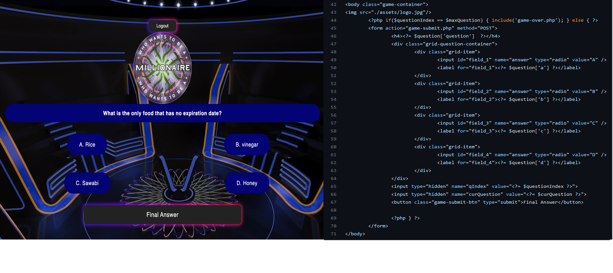
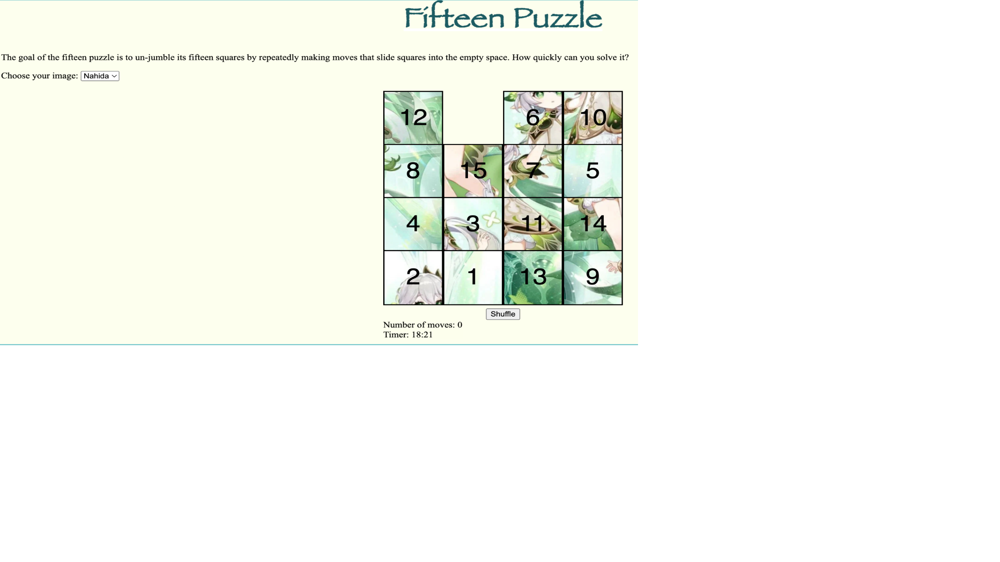

## 🚀 About Me
Hi, This is Nga Vu - (Jennie Vu)
My major is Computer science and I will graduate in May 2023. 
I want to be a Front-end Developer


# Project:

## Who wants to be a millionaire game 
  The game is straightforward , user answer questions and they gain a certain number of point when answer correctly and they lose the name when answer incorrectly. 
### Project Development
  We have a user login and signup pages that allows a personalized experience. As the game is played, the user points are compiled and added to the leaderboard at the end of the game with correspond with their score earned from the game.
  We focus on design a lot on this project because the UI was the aggregate of the project.
We used only 1 main css file to style the login, the game and home page. On the home page, we have section for user can login to the game and a static background. 
### Project Outcomes
  For every question answered correctly, the user will be granted one point. which will be stored in score-info.txt 
  The game included the leader board which will shows top 5 users with the highest score
  


`Github Link`   https://github.com/JVU1998/WebProject1

`Codd link`     https://codd.cs.gsu.edu/~nvu19/WP/PW/WebProject1

## Build With
`PHP`
`HTML`
`CSS`


## Installation
clone my-project repo 
  ```bash
   git clone https://github.com/jennievu/WebProject1.git
   ```


_____________________________________________________________________________


## Fifteen Puzzle game 
  The 15 puzzle is a sliding puzzle made out of 15 numbered square pieces in a 4x4 grid, with one empty spot which allows for moving the pieces around. The objective is to solve the puzzle by bringing the pieces with image on them in the correct order. 
### Project Development
We utilized Imessage to interact and exchange information while the project was being developed. Everyone finished the job on schedule. We are all pleased with how the project turned out.
### Project Outcomes
We have successfully developed the game “Fifteen Puzzle,” which meets all the requirements. For the game, users can choose any image available in the selections. Then, the user will have the ability to shuffle and start playing the game. After finishing the game, the notification will show the message along with the time and the count.


`Github Link`   https://github.com/JVU1998/WebProject2

`codd link`     https://codd.cs.gsu.edu/~nvu19/WP/PW/WebProject2

## Build With

## Installation
clone my-project repo 
  ```bash
   git clone https://github.com/jennievu/WebProject2.git
   ```
## Authors 
- [@JennieVu](https://github.com/jennievu)
- @Brianle1004 (collaborator)
_________________________________________________________________________________
